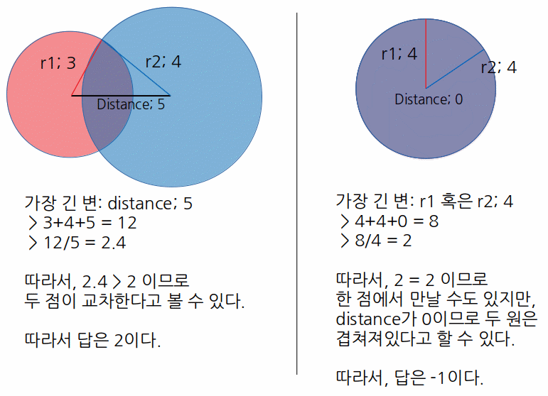

# [[1002] 터렛](http://icpc.me/1002)

- node.js: [:o:]
  - 200404
  - 56:01 .57
  - 시도: 4번

### 메모
 - 두 원의 교점을 찾는 문제
 - 공식이 기억이 나지 않아 오래 걸렸다..
 - 단, **두 원이 겹치는 경우, 가능 위치가 무한대가 될 수 있다!**
 - 문제에서는 이 부분을 -1로 처리해야 하는데 이 부분을 생각하는데 시간이 걸림.

> **_Psudo code_**
> - result := r1+r2+(두 점 사이 거리) / max
> - max := r1, r2, 두 점 사이 거리 중 최댓값
>   - result > 2 : 두 원이 교차; 2
>   - result > 1 : 두 원의 한 부분이 만남; 1
>     - 단, 두 원이 서로 겹쳐있는 경우에는; -1
>   - result > 0 : 두 원이 교차하지 않음; 0

