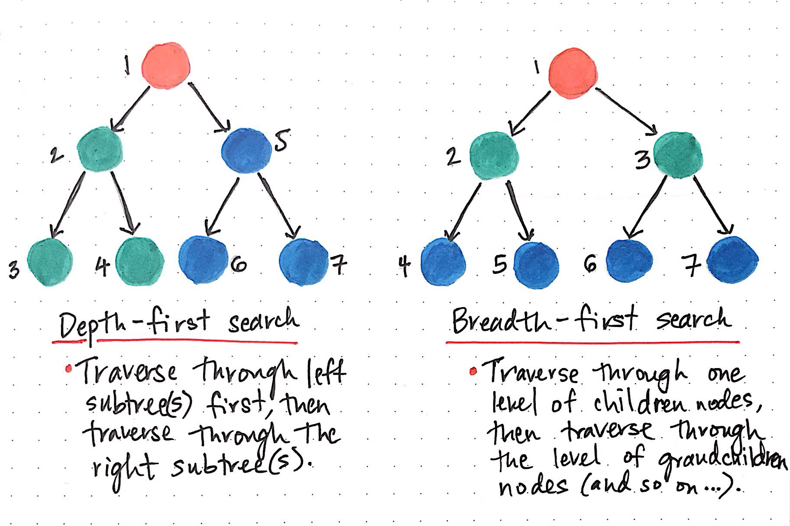

# 1012 유기농 배추
 - tags: 너비 우선 탐색(BFS), 깊이 우선 탐색(DFS), 그래프 이론, 그래프 탐색,
 - lev: s2

 - **C**
   - 200816
   - 1:30:00 .00
   - 시도: 5번
  

### 메모
 - BFS, DFS 문제
 - BFS로 접근하여 해결!
    - 진행방향에 대해 모든 경우를 생각하지 못해 계속 틀림...
       - 처음엔 오른쪽, 아래 방향만 고려
       - 이렇게 짜면 `⏌`자 모양을 2개로 인식 → 왼쪽도 추가
       - 위쪽을 고려 안하면 `⨆`자 모양을 2개로 인식 → 위쪽도 추가
    - 재귀함수 구현 연습하기
       - 초반에 호출 시 리턴을 설정해주어 제대로 동작 안함.. → 재귀함수 겁먹지 말기!

### 참고
 - **DFS와 BFS**  [원본링크 - ebb and flow](https://ebbnflow.tistory.com/173)
 - [[1260] DFS와 BFS](https://uhug.github.io/docs/1260)
